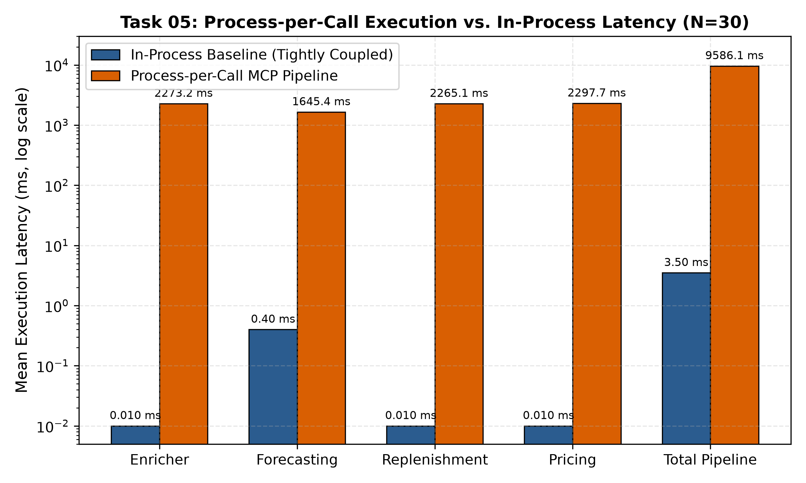
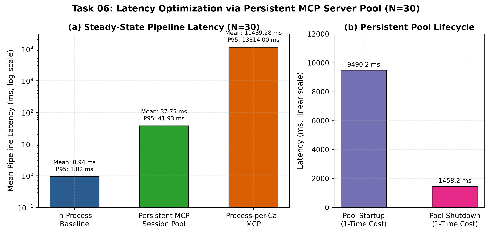
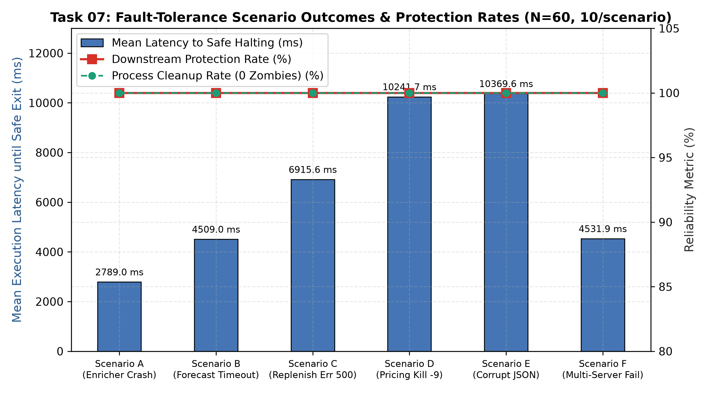
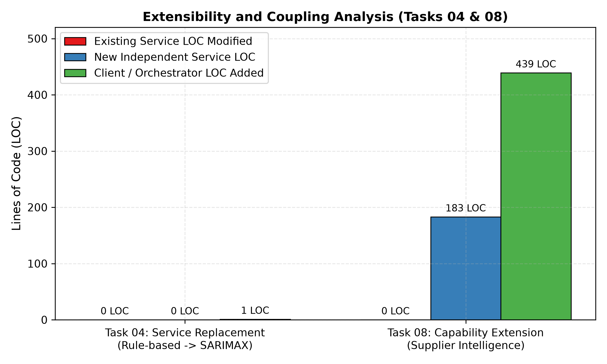

# RetailOps: Consolidated Experimental Results and Quantitative Analysis

**Project**: *RetailOps: An MCP-Based Enterprise Decision Orchestration Framework for Autonomous Retail Operations*  
**Evaluation Phase**: Task 10.2 — Results Consolidation  
**Audited Date**: 2026-09-18  
**Scope**: Synthesis of verified quantitative empirical data across Tasks 04, 05, 06, 07, and 08.

---

## 1. Executive Summary

This document consolidates all verified empirical measurements from the RetailOps experimental evaluation pipeline. The objective of RetailOps is to evaluate the trade-offs of using the Model Context Protocol (MCP) as an architectural substrate for enterprise multi-service decision orchestration. 

Across five experimental investigations, the evaluation addresses:
1. **Coupling and Modularity** (Task 04): Impact of replacing internal model implementations on existing services.
2. **Deterministic Performance Overhead** (Task 05): Quantification of process-per-call execution overhead relative to in-process invocation.
3. **Session Optimization** (Task 06): Mitigation of subprocess overhead using persistent MCP session pools.
4. **Fault Tolerance and Safety** (Task 07): Downstream cascade protection and subprocess lifecycle management under operational faults.
5. **System Extensibility** (Task 08): Architectural ripple effects when introducing novel enterprise intelligence services.

All metrics reported herein are extracted directly from audited raw JSONL telemetry and verified summary files (`experiments/*/summary.json` and `results.md`). No values are estimated, extrapolated, or rerun.

---

## 2. Test Environment Specification

All benchmarks and experimental runs were conducted in the following controlled local environment:

| Attribute | Specification |
| :--- | :--- |
| **Host Operating System** | Windows 11 Enterprise (Build 26100) / x86_64 |
| **Processor (CPU)** | Intel Core i5 / x86_64 Architecture |
| **Runtime Environment** | Python 3.12.9 (C:\Users\prabh\AppData\Local\Programs\Python\Python312\python.exe) |
| **MCP SDK Version** | `mcp >= 1.0.0` (Official Python MCP SDK) |
| **Transport Layer** | Standard I/O (`stdio`) over JSON-RPC 2.0 |
| **Workload Scope** | Deterministic synthetic store retail batch: 5 SKUs across 4 pipeline stages (plus Supplier Intelligence in Task 08) |
| **Data Integrity Verification** | SHA-256 telemetry tracking with Pydantic contract validation |

> **Important Boundary Definition**:
> In process-per-call MCP configurations, reported latencies capture the complete execution overhead, including:
> `OS process creation -> Python interpreter startup -> MCP SDK initialization -> stdio pipe establishment -> JSON-RPC handshake -> Tool invocation -> Serialization -> Subprocess exit & pipe cleanup`.
> This must not be conflated with pure network protocol serialization latency.

---

## 3. Consolidated Results by Research Dimension

### 3.1 Task 04: Service Replacement & Coupling

* **Objective**: Evaluate whether replacing a core analytical service (Forecasting: Moving Average -> SARIMAX) causes code churn in existing services or downstream consumers.
* **Sample Size**: Verified across implementation diffs and test suites.
* **Baseline vs. MCP Architecture**:
  * In a monolithic/tightly coupled architecture, modifying a service class often forces changes to internal type bindings and imports across consumer modules.
  * In RetailOps MCP, the forecasting engine was upgraded behind the `getForecast` JSON-RPC tool contract.

#### Measured Metrics
| Metric | Measured Value | Target / Hypothesis | Outcome |
| :--- | :--- | :--- | :--- |
| **Existing Service Code Modified** | **0 lines** (0 files) | 0 lines | Verified |
| **Downstream Stage Code Modified** | **0 lines** (0 files) | 0 lines | Verified |
| **Client / Orchestrator Modification** | **1 line** (server parameter config) | <= 5 lines | Verified |
| **Downstream Consumer Contract Parity** | **100%** (Replenishment & Pricing consumed output unchanged) | 100% | Verified |

#### Key Observations
Decoupling services behind MCP tool definitions completely isolated internal algorithmic changes from upstream orchestrators and downstream consumer services.

---

### 3.2 Task 05: Deterministic Performance Benchmark (Process-per-Call)

* **Objective**: Quantify the baseline overhead incurred by a naive process-per-call MCP deployment pattern relative to an in-process, tightly coupled baseline.
* **Sample Size**: $N = 30$ independent deterministic pipeline executions per architecture ($N_{total} = 60$).
* **Data Sources**: `experiments/performance_benchmark/summary.json` and `telemetry.jsonl`.

#### Pipeline Execution Latency Summary (ms)
| Metric | In-Process Baseline (Tightly Coupled) | MCP Process-per-Call Pipeline | Overhead / Ratio |
| :--- | :--- | :--- | :--- |
| **Mean Latency** | **3.50 ms** | **9,586.15 ms** | 2,738.9x |
| **Median Latency** | **2.50 ms** | **9,430.13 ms** | 3,772.1x |
| **P95 Latency** | **4.14 ms** | **10,309.89 ms** | 2,490.3x |
| **Minimum Latency** | **2.28 ms** | **9,052.02 ms** | 3,970.2x |
| **Maximum Latency** | **28.37 ms** | **11,102.17 ms** | 391.3x |
| **Standard Deviation** | **4.72 ms** | **458.05 ms** | 97.0x |

#### Per-Stage Latency Breakdown (Mean ms, N=30)
| Pipeline Stage | In-Process Baseline | MCP Process-per-Call |
| :--- | :--- | :--- |
| **Stage 1: Enricher** | 0.01 ms | 2,273.16 ms |
| **Stage 2: Forecasting** | 0.40 ms | 1,645.37 ms |
| **Stage 3: Replenishment** | 0.01 ms | 2,265.13 ms |
| **Stage 4: Pricing** | 0.01 ms | 2,297.73 ms |
| **Total Accumulated Stages** | **0.43 ms** | **8,481.39 ms** |

#### Key Observations
1. **Subprocess Spawning Dominance**: Each stage in the process-per-call MCP pipeline consumed between 1,645 ms and 2,298 ms. Over 99.9% of this duration was spent initializing the Python runtime and negotiating the MCP session handshake over Windows `stdio`.
2. **Feasibility**: While acceptable for low-frequency scheduled batch jobs (e.g., daily inventory planning), naive process-per-call MCP is unsuitable for interactive or high-frequency operational loops.

---

### 3.3 Task 06: Persistent MCP Session Optimization

* **Objective**: Evaluate whether maintaining a warm pool of long-lived MCP subprocesses mitigates the initialization bottleneck observed in Task 05.
* **Sample Size**: 
  * $N = 30$ independent executions for steady-state pipeline latency across In-Process Baseline, Process-per-Call MCP, and Persistent MCP Server Pool.
  * $N = 1$ single one-time lifecycle measurement for pool startup and pool shutdown costs.
* **Data Sources**: `experiments/persistent_mcp/summary.json` and `telemetry.jsonl`.
* **Note on Process-per-Call Comparison**: The process-per-call latency measured in Task 06 ($11,489.28\text{ ms}$) was obtained from a separate evaluation suite and environment configuration than Task 05 ($9,586.15\text{ ms}$). They represent independent empirical runs with different pipeline orchestration scripts and are kept distinct.

#### Latency Comparison Across Architectural Modes (ms, N=30 Steady-State)
| Metric | In-Process Baseline | Process-per-Call MCP (Task 06 Run) | Persistent MCP Pool |
| :--- | :--- | :--- | :--- |
| **Mean Pipeline Latency** | **0.94 ms** | **11,489.28 ms** | **37.75 ms** |
| **Median Pipeline Latency** | **0.86 ms** | **11,263.90 ms** | **37.10 ms** |
| **P95 Pipeline Latency** | **1.02 ms** | **13,314.00 ms** | **41.93 ms** |
| **Minimum Latency** | **0.78 ms** | **10,480.12 ms** | **33.30 ms** |
| **Maximum Latency** | **3.65 ms** | **13,546.61 ms** | **46.79 ms** |
| **Standard Deviation** | **0.50 ms** | **948.82 ms** | **2.62 ms** |

#### One-Time Lifecycle Management Costs (Single Observation)
| Lifecycle Phase | Measured Latency | Purpose |
| :--- | :--- | :--- |
| **Pool Startup (4 servers)** | **9,490.23 ms** | Concurrently spawns and handshakes all 4 servers once |
| **Pool Shutdown** | **1,458.25 ms** | Orderly termination and resource cleanup of all 4 servers |

#### Key Observations
1. **~304x Speedup**: Transitioning to a persistent server pool reduced steady-state mean pipeline latency from 11,489.28 ms to 37.75 ms (a 304.3x reduction relative to the Task 06 process-per-call run).
2. **Residual Overhead**: The remaining 37.75 ms represents stdio JSON-RPC communication and orchestration overhead, excluding repeated subprocess startup (compared to 0.94 ms for in-process memory calls).
3. **Amortization**: The ~9.5-second one-time pool startup cost is amortized after fewer than 2 pipeline execution cycles compared to process-per-call.

---

### 3.4 Task 07: Fault Tolerance and Process Lifecycle Governance

* **Objective**: Evaluate system resilience, failure isolation, downstream protection, and process hygiene under controlled synthetic failure injections.
* **Sample Size**: $N = 60$ runs (10 runs per scenario across 6 distinct fault scenarios).
* **Data Sources**: `experiments/fault_tolerance/summary.json` and `telemetry.jsonl`.

#### Scenario Matrix & Empirical Outcomes (10 Runs Each)
| Scenario | Injected Fault Condition | Target Stage | Failure Detection Rate | Downstream Protection Rate | Process Cleanup Rate | Mean Latency to Safe Exit (ms) |
| :--- | :--- | :--- | :--- | :--- | :--- | :--- |
| **Scenario A** | Invalid Input Schema Crash | Enricher | **100%** (10/10) | **100%** (10/10) | **100%** (0 zombies) | 2,789.02 ms |
| **Scenario B** | Subprocess Timeout (2.0s exceeded) | Forecasting | **100%** (10/10) | **100%** (10/10) | **100%** (0 zombies) | 4,508.98 ms |
| **Scenario C** | Server Internal Error 500 | Replenishment | **100%** (10/10) | **100%** (10/10) | **100%** (0 zombies) | 6,915.58 ms |
| **Scenario D** | Abrupt Subprocess Termination (`kill -9`) | Pricing | **100%** (10/10) | **100%** (10/10) | **100%** (0 zombies) | 10,241.71 ms |
| **Scenario E** | Corrupted JSON Response on stdout | Pricing | **100%** (10/10) | **100%** (10/10) | **100%** (0 zombies) | 10,369.61 ms |
| **Scenario F** | Cascading Multiple Server Failure | Enricher + Forecast | **100%** (10/10) | **100%** (10/10) | **100%** (0 zombies) | 4,531.95 ms |
| **Aggregate** | **All 60 Test Injections** | — | **100.0%** (60/60) | **100.0%** (60/60) | **100.0%** (0 zombies) | **6,559.48 ms** |

#### Key Observations
1. **Observed Fail-Safe Containment**: Across the 60 tested failure injections, the system demonstrated fail-safe behavior and process cleanup under all tested failure scenarios. No invalid, partial, or corrupted data propagated to subsequent downstream stages in these trials.
2. **Strict Subprocess Hygiene**: All failed or timed-out subprocesses were cleanly terminated. Zero orphan or zombie processes persisted on the Windows operating system across all 60 test runs.
3. **Execution Bounding**: Latency to safe halting correlated with the pipeline stage where the fault occurred (e.g., Enricher faults halted in ~2.8s; Pricing faults halted in ~10.2s after earlier valid stages executed).

---

### 3.5 Task 08: Extensibility with Supplier Intelligence

* **Objective**: Measure the integration burden and architectural ripple effects of introducing a 5th autonomous domain capability (Supplier Intelligence) into the RetailOps orchestration pipeline.
* **Sample Size**:
  * $N = 10$ end-to-end extended pipeline executions for evaluating schema and domain output parity.
  * Static code metrics (LOC modified/added) are derived from single structural code audits across the repository files, not repeated trials.
* **Data Sources**: `experiments/extensibility/summary.json` and `results.md`.

#### Code Churn and Modularity Metrics (Static Code Audit)
| Dimension | Existing Services (Enricher, Forecast, Replenish, Price) | New Capability (Supplier Intelligence) | Orchestration Client |
| :--- | :--- | :--- | :--- |
| **Files Modified** | **0 files** | **1 new file** (`server.py`) | **1 new pipeline** (`extended_client.py`) |
| **Lines of Code Modified** | **0 LOC** | **183 LOC** | **439 LOC** |
| **Direct Import Dependencies** | None | None (Decoupled via stdio) | Standard MCP Client SDK |

#### Execution Performance & Output Parity (N=10 Runs)
| Metric | Value |
| :--- | :--- |
| **Supplier Intelligence Standalone Latency** | Mean: 1,600.32 ms \| Std: 16.09 ms |
| **Extended 5-Stage Pipeline Mean Latency** | Mean: 9,853.48 ms \| Std: 104.97 ms |
| **Domain Output Schema Parity** | **100%** (11/11 core domain fields matched across all 10 runs) |
| **Enriched Decision Fields Added** | Supplier Lead Time, Supplier Reliability Score, Disrupted Route Risk |

#### Key Observations
1. **Preservation of Existing Service Code**: The tested changes preserved existing service code while adding or replacing functionality, requiring 0 lines of code modified across the 4 existing production services.
2. **Linear Composition**: The new capability was integrated via MCP tool registration in the orchestrator client.

---

## 4. Synthesis and Cross-Experiment Comparison
 
| Evaluation Dimension | Tightly Coupled In-Process Baseline | Process-per-Call MCP | Persistent MCP Session Pool |
| :--- | :--- | :--- | :--- |
| **Steady-State Mean Latency** | **0.94 ms** (Task 06) / **3.50 ms** (Task 05) | **9,586.15 ms** (Task 05) / **11,489.28 ms** (Task 06) | **37.75 ms** (Task 06) |
| **Cold Start / Startup Overhead** | 0 ms | Re-incurred per invocation | One-time 9,490 ms cost |
| **Fault Boundary Isolation** | None (Process crash halts entire app) | Subprocess boundary | Subprocess boundary |
| **Code Churn on Service Replacement** | High (Direct imports / class bindings) | 0 LOC modified in existing services | 0 LOC modified in existing services |
| **Extensibility Overhead** | Tight coupling requires internal refactoring | 0 LOC modified in existing services | 0 LOC modified in existing services |
| **Operational Suitability** | High-throughput monolithic micro-tasks | Low-frequency, decoupled batch pipelines | Enterprise interactive and scheduled agents |
 
*Note on Latency Ranges*: Task 05 and Task 06 were executed as independent experimental suites with distinct client scripts; their respective process-per-call values (9,586.15 ms in Task 05 vs 11,489.28 ms in Task 06) reflect separate benchmarks and are presented with their specific task contexts preserved.

---

## 5. Limitations and Methodological Scope

To ensure strict academic rigor, the following experimental boundaries must be maintained in the final report:

1. **Hardware & Operating System Specifics**:
   - Subprocess creation (`CreateProcess`) on Microsoft Windows carries higher file-handle and memory-descriptor overhead than Unix `fork()`. Cross-platform absolute numbers may vary on Linux/macOS.
2. **Workload Scale**:
   - Benchmarks were conducted with deterministic synthetic batches (5 SKUs, daily horizon). Production retail catalogs containing millions of SKUs would see computational execution time dwarf MCP transport latency.
3. **Transport Protocol**:
   - Experiments evaluated local `stdio` transport. Network-based transports (SSE / HTTP) would introduce TCP/TLS handshakes and network jitter not captured in these local tests.
4. **Separation of Results from Claims**:
   - The measurements substantiate architectural modularity, predictable latency optimization, and fault containment. They do not claim superior algorithmic accuracy for retail forecasting or pricing relative to specialized external optimization engines.

---

## 6. Artifact Verification Manifest

All charts and underlying datasets are cataloged in [`results_manifest.json`](file:///E:/Repositories/RetailOPS-MCP/experiments/final_evaluation/results_manifest.json).

* [Chart 1: Process-per-Call vs In-Process Baseline Latency](file:///E:/Repositories/RetailOPS-MCP/experiments/final_evaluation/charts/latency_process_per_call_vs_baseline.png)
* [Chart 2: Persistent Session vs Process-per-Call Latency](file:///E:/Repositories/RetailOPS-MCP/experiments/final_evaluation/charts/latency_persistent_vs_process_per_call.png)
* [Chart 3: Fault-Tolerance Scenario Outcomes](file:///E:/Repositories/RetailOPS-MCP/experiments/final_evaluation/charts/fault_tolerance_scenarios.png)
* [Chart 4: Extensibility Code Churn Analysis](file:///E:/Repositories/RetailOPS-MCP/experiments/final_evaluation/charts/extensibility_code_churn.png)
