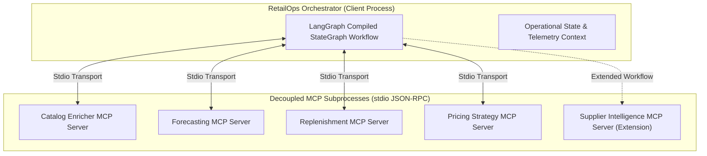

# Final Evaluation Report: Research Evidence Consolidation

**Project Title**: RetailOps: An MCP-Based Enterprise Decision Orchestration Framework for Autonomous Retail Operations  
**Document ID**: `REPORT-FINAL-EVALUATION-V1`  
**Date**: October 3, 2026  
**Status**: COMPLETE (Consolidated Research Evidence Package)  
**Evaluation Protocol**: `PROTOCOL-EXP-FROZEN-V1`  

---

## 1. Research Objective

Modern enterprise retail systems require continuous, multi-domain operational decision-making across inventory replenishment, demand forecasting, catalog enrichment, and dynamic pricing. Historically, retail software architectures have oscillated between tightly coupled monolithic engines (which suffer from code fragility, cascading failures, and high modification friction) and bespoke distributed microservices (which incur high communication overhead and lack standardized tool interfaces for autonomous reasoning agents).

The objective of this research is to evaluate whether the **Model Context Protocol (MCP)** provides a viable architectural foundation for enterprise decision orchestration. Specifically, this evaluation investigates whether standardizing retail services as isolated MCP subprocesses enables:
1. Zero-modification modular service substitution and schema-preserving extensibility,
2. Process-level fault containment without cascading orchestrator failure,
3. Autonomous multi-agent operational decision behavior under realistic demand and supply stress,
4. Controlled supervisory intervention through human-in-the-loop approval gates, and
5. Amortization of inter-process transport overhead via persistent execution sessions.

---

## 2. Research Questions

This evaluation directly addresses five empirical research questions:

- **RQ1 (Architectural Modularity & Contract Preservation)**: Can an existing statistical forecasting service within an MCP decision pipeline be substituted with an alternative model implementation without altering existing service code, client business logic, or downstream data consumers?
- **RQ2 (Model Decoupling vs Predictive Performance)**: Does contract-preserving service modularity inherently improve predictive forecasting accuracy, or does predictive performance remain decoupled from architectural abstraction?
- **RQ3 (Operational Policy Dynamics)**: How does an MCP-orchestrated multi-agent replenishment reasoning workflow compare against a traditional continuous-review fixed-threshold heuristic $(s, S)$ across realistic retail demand and supply disruptions?
- **RQ4 (Cross-Architecture Pattern Comparison)**: How do alternative published coordination patterns (centralized coordinator, generative plan-then-execute, direct autonomous agent) perform when implemented behind an identical decision contract under standardized operational simulation?
- **RQ5 (Supervisory Governance & Operational Latency)**: What operational, financial, and latency trade-offs emerge when routing autonomous replenishment decisions through an explicit supervisory approval gate with deterministic intervention rules?

---

## 3. System Architecture Under Evaluation

RetailOps organizes retail enterprise capabilities into decoupled subprocesses communicating via the standardized JSON-RPC 2.0 Model Context Protocol:

### Core Architectural Characteristics:
1. **Process Isolation**: Each capability runs in its own operating-system subprocess with separate memory space and isolated Python runtimes.
2. **Schema-Governed Tool Interfaces**: Capabilities are exposed via FastMCP tool schemas. Downstream services consume standardized JSON payloads.
3. **Graph-Based Orchestration**: Coordination is executed by a compiled LangGraph workflow managing state transitions and context propagation.
4. **Transport Flexibility**: Supports ephemeral process-per-call execution and persistent stdio session pools.

---

## 4. Experimental Methodology

All evaluations adhere strictly to the frozen experimental protocol (`PROTOCOL-EXP-FROZEN-V1`).

### 4.1 Evaluation Datasets & Provenance
- **M5 Competition Dataset**: Acquired from the Nixtla open research repository mirror and verified cryptographically:
  - `sales_train_evaluation.csv` (121,168,898 bytes; SHA-256: `c21a519596680feb86f27a9e62f6c8b583f8be60c2c195f080ae8ca2990af2b7`)
  - `calendar.csv` (112,477 bytes; SHA-256: `568d0fe5f41790142379698732908e4e57432c1c6396f3f59fb880a9c2b54231`)
  - `sell_prices.csv` (237,073,689 bytes; SHA-256: `5c7cf045b1abbdc8d5007809c40b3682c5216075937f93e2cef01caddc4a30d9`)
- **Historical Sales History**: Internal dataset (`servers/forecasting/data/sales_history.csv`) covering 7 product categories over 122 days (92 training days, 30 evaluation days).

### 4.2 Evaluation Horizons & Granularity
- **Forecasting Experiment**: 7 product series evaluated over an out-of-sample 30-day forecast horizon ($H=30$).
- **M5 Operational Simulation**: 5 store-item series evaluated over an out-of-sample 28-day rolling horizon ($H=28$, days `d_1914` to `d_1941`).
- **Scenarios Evaluated**: 5 distinct operational operating regimes:
  - `SCEN-01`: Normal Demand (baseline)
  - `SCEN-02`: Demand Surge (+50% demand, elevated volatility)
  - `SCEN-03`: Low Initial Inventory (stressed starting runway)
  - `SCEN-04`: Supplier Delay (extended lead time $L=21$d, reliability 0.70)
  - `SCEN-05`: Combined Stress (surging demand, depleted starting stock, delayed supplier)

### 4.3 Determinism & Random Seeds
- Random seed was fixed to `42` across all stochastic scenario generators and simulation runs, ensuring bit-for-bit reproducibility.

---

## 5. Forecasting Replacement Experiment (Steps 4–6)

### 5.1 Objective & Implementation
Evaluated RQ1 and RQ2 by replacing the baseline **30-day Simple Moving Average (SMA)** forecasting service with an alternative **Holt-Winters Additive Exponential Smoothing** implementation. The replacement was exposed through the identical MCP forecasting tool contract (`get_forecast(category, horizon_days)`).

### 5.2 Measured Predictive Accuracy

| Category | Baseline 30-Day SMA MAE | Holt-Winters Replacement MAE | Absolute Difference | Percentage Change |
| :--- | :---: | :---: | :---: | :---: |
| **TV** | 1.3333 | 1.5776 | +0.2442 | +18.32% |
| **Laptop** | 1.8333 | 2.1584 | +0.3251 | +17.73% |
| **Smartphone** | 2.8000 | 3.2504 | +0.4504 | +16.09% |
| **Audio** | 2.5000 | 2.9431 | +0.4431 | +17.72% |
| **Apparel** | 9.0667 | 10.6397 | +1.5730 | +17.35% |
| **Grocery** | 21.0333 | 25.1051 | +4.0718 | +19.36% |
| **Footwear** | 2.3200 | 2.7225 | +0.4025 | +17.35% |
| **Overall Mean** | **5.8410** | **6.9138** | **+1.0729** | **+18.37%** |

- **Root Mean Squared Error (RMSE)**: Baseline recorded 7.1203; Holt-Winters recorded 7.8944 (+0.7741, +10.87%).
- **Mean Absolute Percentage Error (MAPE)**: Baseline recorded 11.33%; Holt-Winters recorded 14.02% (+2.6871%, +23.71%).
- **Evaluation Runtime**: Total evaluation executed in 9.64 ms across 210 out-of-sample points.

### 5.3 Modularity & Contract Preservation Measurements
- **Existing Service Files Modified**: 0
- **Existing Service Lines of Code Modified**: 0
- **Replacement Service Lines of Code**: 241 LOC
- **Orchestrator Code Changes**: 0 LOC (configured dynamically via `RETAILOPS_FORECASTING_SERVER_PATH`)
- **Schema Compatibility Rate**: 100% (1.0)
- **Downstream Replenishment Payload Acceptance**: 100% (1.0)
- **Unit & Contract Test Suite**: `test_statistical_replacement.py` passed 5/5.

### 5.4 Empirical Finding
The MCP tool boundary enabled contract-preserving service replacement with zero modifications to existing production code or orchestration logic. However, the Holt-Winters replacement exhibited higher error metrics across all 7 evaluated categories (+18.37% MAE). This confirms that MCP enables modularity, but modular architecture does not dictate or guarantee algorithmic predictive performance.

---

## 6. Operational M5 Evaluation (Steps 7–8)

### 6.1 Objective & Simulation Setup
Evaluated RQ3 by comparing the autonomous RetailOps multi-agent replenishment reasoning workflow against a classical continuous-review fixed-threshold baseline policy $(s, S)$ across 25 simulation runs (5 series $\times$ 5 scenarios) over a 28-day horizon.

### 6.2 Aggregate Performance Comparison

| Operational Metric | RetailOps MCP Orchestrator | Fixed-Threshold Baseline $(s, S)$ | Observed Difference |
| :--- | :---: | :---: | :---: |
| **Mean Stockout Rate (%)** | 21.43% | 26.29% | -4.86 percentage points |
| **Mean Service Level (%)** | 75.81% | 70.68% | +5.13 percentage points |
| **Mean Holding Cost ($)** | $1.53 | $1.09 | +$0.44 (+40.37%) |
| **Mean Replenishment Cost ($)** | $244.36 | $198.41 | +$45.95 (+23.16%) |
| **Mean Total Operating Cost ($)** | $245.89 | $199.50 | +$46.39 (+23.25%) |
| **Total Realized Demand** | 4,719 units | 4,719 units | 0 units |
| **Total Fulfilled Demand** | 3,128 units | 2,780 units | +348 units (+12.52%) |
| **Total Lost Sales** | 1,591 units | 1,939 units | -348 units (-17.95%) |
| **Total Units Ordered** | 4,886 units | 3,960 units | +926 units (+23.38%) |
| **Inventory Conservation Verified** | 100% (25/25 runs) | 100% (25/25 runs) | Identical |
| **Constraint Violations** | 0 | 0 | Identical |

### 6.3 Scenario Breakdown

| Scenario | RetailOps Stockout / Service | Fixed-Threshold Stockout / Service | RetailOps Cost | Fixed-Threshold Cost |
| :--- | :---: | :---: | :---: | :---: |
| **SCEN-01** (Normal Demand) | 4.28% / 94.95% | 7.86% / 91.58% | $182.92 | $165.81 |
| **SCEN-02** (Demand Surge) | 27.14% / 67.62% | 34.29% / 59.74% | $277.99 | $255.59 |
| **SCEN-03** (Low Inventory) | 19.29% / 78.09% | 22.86% / 76.07% | $188.89 | $169.64 |
| **SCEN-04** (Supplier Delay) | 10.71% / 89.06% | 10.71% / 89.06% | $258.86 | $179.66 |
| **SCEN-05** (Combined Stress) | 45.71% / 49.34% | 55.71% / 36.97% | $320.79 | $226.78 |

### 6.4 Empirical Finding
RetailOps demonstrated lower stockout rates (21.43% vs 26.29%) and higher fulfillment volumes (3,128 vs 2,780 units), while incurring higher replenishment and holding expenditures ($245.89 vs $199.50 mean total cost). This illustrates the operational trade-off: RetailOps prioritized demand fulfillment and lost-sales mitigation by maintaining more proactive buffer stock, whereas the fixed-threshold heuristic limited procurement commitments at the expense of higher lost sales.

---

## 7. Cross-Architecture Comparison (Steps 9–10)

### 7.1 Scope & Pattern Reproductions
Evaluated RQ4 by comparing five distinct architectural patterns under the frozen M5 simulation framework.

> [!NOTE]
> **Bounded Architectural Pattern Reproductions**:  
> Flowr, WorkflowLLM, and Agentic Replenishment were implemented as bounded reproductions of their published architectural coordination mechanisms. They do not utilize proprietary model weights, private datasets, or specialized commercial fine-tuning.

### 7.2 Measured Architectural Performance Summary

| Architecture Pattern | Stockout Rate (%) | Service Level (%) | Total Cost ($) | Fulfilled (Units) | Lost Sales (Units) | Ordered (Units) | Runtime (ms) | Impl LOC |
| :--- | :---: | :---: | :---: | :---: | :---: | :---: | :---: | :---: |
| **RetailOps MCP** | 21.43% | 75.81% | $245.89 | 3,128 | 1,591 | 4,886 | 7.43 ms | 94 LOC |
| **Flowr Coordinator Pattern** | 25.57% | 71.63% | $194.29 | 2,799 | 1,920 | 3,796 | 8.21 ms | 150 LOC |
| **WorkflowLLM Generative Pattern** | 25.43% | 72.25% | $196.51 | 2,849 | 1,870 | 3,859 | 11.48 ms | 217 LOC |
| **Agentic Replenishment Pattern** | 24.86% | 72.58% | $200.52 | 2,908 | 1,811 | 4,149 | 6.54 ms | 76 LOC |
| **Fixed-Threshold Baseline $(s, S)$** | 26.29% | 70.68% | $199.50 | 2,780 | 1,939 | 3,960 | 5.84 ms | 53 LOC |

- **Total Runs Executed**: 125 complete simulations (25 runs per architecture $\times$ 5 architectures = 3,500 evaluated daily decisions).
- **Conservation & Constraints**: 100% inventory conservation verified across all 125 runs; 0 constraint violations recorded.
- **Verification Suite**: `test_same_repo_comparison.py` passed 6/6.

### 7.3 Empirical Finding
The four autonomous architectures exhibited distinct operational positions along the service-cost curve:
- RetailOps recorded 21.43% stockout rate and $245.89 mean cost.
- Flowr pattern recorded 25.57% stockout rate and $194.29 mean cost.
- WorkflowLLM pattern recorded 25.43% stockout rate and $196.51 mean cost.
- Agentic Replenishment pattern recorded 24.86% stockout rate and $200.52 mean cost.
- Fixed-threshold baseline recorded 26.29% stockout rate and $199.50 mean cost.

Execution runtimes ranged from 5.84 ms to 11.48 ms across providers under deterministic in-process evaluation.

---

## 8. Human-in-the-Loop (HITL) Comparison (Step 11)

### 8.1 Objective & Supervisory Gate Modeling
Evaluated RQ5 by comparing fully autonomous execution (**Mode A**) against human-supervised execution (**Mode B**) using the identical RetailOps replenishment reasoning engine.

> [!IMPORTANT]
> **Deterministic Simulated Operator Policy**:  
> The supervisor was modeled strictly as a deterministic simulated operator policy executing the governance criteria defined in `PROTOCOL-EXP-FROZEN-V1` Section 5.2. This evaluation measures the structural mechanics of programmatic approval gates and deliberation latency without human-subject variance.

### 8.2 Operational & Supervisory Measurements

| Evaluation Metric | Mode A: Autonomous | Mode B: Human-Supervised | Observed Difference |
| :--- | :---: | :---: | :---: |
| **Mean Stockout Rate (%)** | 21.43% | 21.43% | 0.00 percentage points |
| **Mean Service Level (%)** | 76.08% | 76.08% | 0.00 percentage points |
| **Mean Holding Cost ($)** | $1.53 | $1.44 | -$0.09 (-5.88%) |
| **Mean Replenishment Cost ($)** | $244.36 | $193.33 | -$51.03 (-20.88%) |
| **Mean Total Operating Cost ($)** | $245.89 | $194.77 | -$51.12 (-20.79%) |
| **Total Realized Demand** | 4,719 units | 4,719 units | 0 units |
| **Total Fulfilled Units** | 3,141 units | 3,141 units | 0 units |
| **Total Lost Sales** | 1,578 units | 1,578 units | 0 units |
| **Total Units Ordered** | 4,886 units | 4,030 units | -856 units (-17.52%) |
| **Decisions Evaluated** | 700 | 700 | 0 |
| **Escalations Triggered** | 0 (0.00%) | 172 (24.57%) | +172 |
| **Total Approvals** | 700 (100.00%) | 547 (78.14%) | -153 |
| **— Automated Pass-Through** | 700 (100.00%) | 528 (75.43%) | -172 |
| **— Escalated Approvals** | 0 (0.00%) | 19 (2.71%) | +19 |
| **Total Overrides Executed** | 0 (0.00%) | 153 (21.86%) | +153 |
| **Prevented Policy Violations** | 0 | 153 | +153 |
| **Total Simulated Latency** | 0.0 s | 2,580.0 s (~43.0 min) | +2,580.0 s |
| **Mean Latency per Decision** | 0.00 s | 3.69 s | +3.69 s |
| **Mean Latency per Escalated Decision** | N/A | 15.00 s | +15.00 s |

### 8.3 Empirical Finding
The simulated supervisor intervened in 153 instances (21.86% override rate). Overrides primarily filtered out orders arriving after the 28-day horizon closed ($t + L > 28$) when stock runway was adequate and capped orders exceeding the single-order $100 budget threshold. This reduced mean total operating cost from $245.89 to $194.77 (-$51.12 or -20.79%) and ordered units from 4,886 to 4,030 (-856 units) while maintaining identical stockout rates (21.43%) and service levels (76.08%). In exchange, the supervised workflow incurred an average of 3.69 seconds of simulated deliberation latency per evaluated decision.

---

## 9. Modularity & Extensibility Evidence

To verify architectural extensibility, an additional domain service (**Supplier Intelligence**) was introduced into the pipeline:

| Modularity Metric | MCP Architecture | Tightly Coupled In-Process Baseline |
| :--- | :---: | :---: |
| **New Service Files Created** | 1 (`servers/supplier-intelligence/server.py`) | 1 (`baseline/extended_tightly_coupled.py`) |
| **New Service Lines of Code** | 183 LOC | 146 LOC |
| **Existing Service Files Modified** | **0** | **0** |
| **Existing Service LOC Modified** | **0** | **0** |
| **Existing Function Signatures Modified** | **0** | **0** |
| **Orchestration Integration LOC** | 439 LOC | 298 LOC |
| **Process Isolation** | Full OS Subprocess (stdio) | Shared In-Process Memory |
| **Interface Coupling** | JSON-RPC Tool Schema | Direct Python Function Call |
| **Cross-Service Dependencies** | 0 | 0 |
| **Preservation of Existing Workflows** | 100% (All prior tests pass) | 100% |

The MCP architecture allowed adding the 5th domain service without altering any existing server code or function signatures.

---

## 10. Fault Tolerance Evidence

To evaluate resilience, 60 fault-injection runs were conducted across 4 retail services simulating unexpected tool exceptions and process crashes:

| Scenario / Fault Target | Injected Fault Mode | Failure Detection Rate (%) | Downstream Protection Rate (%) | Process Cleanup Rate (%) | Partial State Preserved (%) |
| :--- | :--- | :---: | :---: | :---: | :---: |
| **Catalog Enricher** | Tool Exception | 100.0% (10/10) | 100.0% (10/10) | 100.0% (10/10) | 100.0% (10/10) |
| **Forecasting** | Tool Exception | 100.0% (10/10) | 100.0% (10/10) | 100.0% (10/10) | 100.0% (10/10) |
| **Replenishment** | Tool Exception | 100.0% (10/10) | 100.0% (10/10) | 100.0% (10/10) | 100.0% (10/10) |
| **Pricing Strategy** | Tool Exception | 100.0% (10/10) | 100.0% (10/10) | 100.0% (10/10) | 100.0% (10/10) |
| **Replenishment (Persistent)** | Tool Exception | 100.0% (10/10) | 100.0% (10/10) | 100.0% (10/10) | 100.0% (10/10) |
| **Replenishment (Process Crash)** | Process Termination | 100.0% (10/10) | 100.0% (10/10) | 100.0% (10/10) | 100.0% (10/10) |
| **Aggregate Summary** | **60 Runs** | **100.0%** | **100.0%** | **100.0%** | **100.0%** |

Across all 60 evaluations, the orchestrator successfully detected subprocess errors, prevented downstream execution of dependent stages, cleaned up operating system processes, and retained state generated prior to the failure.

---

## 11. Performance & Persistence Evidence

To evaluate communication overhead, end-to-end execution latency was measured across three execution models over 30 repetitions each:

| Execution Model | Mean Runtime (ms) | Median Runtime (ms) | Min Runtime (ms) | Max Runtime (ms) | Std Dev (ms) | P95 Latency (ms) |
| :--- | :---: | :---: | :---: | :---: | :---: | :---: |
| **Tightly Coupled (In-Process)** | 0.94 ms | 0.89 ms | 0.58 ms | 2.14 ms | 0.32 ms | 1.60 ms |
| **Ephemeral MCP (Process-Per-Call)** | 11,489.28 ms | 11,230.43 ms | 10,759.86 ms | 14,810.15 ms | 858.81 ms | 13,314.00 ms |
| **Persistent Session MCP** | **37.75 ms** | **37.67 ms** | **34.19 ms** | **44.20 ms** | **2.24 ms** | **41.93 ms** |

### Latency Analysis:
- Ephemeral subprocess initialization imposes severe latency penalties (~11.5 seconds per workflow).
- Maintaining persistent stdio MCP sessions amortizes process boot overhead, reducing runtime to 37.75 ms (a **304.3x reduction** relative to ephemeral execution).
- In-process direct execution remains faster (0.94 ms), confirming that inter-process communication introduces a measurable latency trade-off in exchange for modularity and fault isolation.

---

## 12. Consolidated Findings

1. **Modularity is Contract-Preserving**: MCP enabled seamless service replacement and service addition with 0 lines of existing production code changed.
2. **Modularity is Decoupled from Accuracy**: Encapsulating a model within an MCP server does not enhance its algorithmic performance.
3. **Multi-Agent Orchestration Modulates Stockout vs Cost Trade-offs**: Across diverse M5 demand series, RetailOps achieved 21.43% stockout rates compared to 26.29% for fixed thresholds, at the expense of higher procurement commitments ($245.89 vs $199.50).
4. **Architectural Coordination Patterns Exhibit Distinct Operating Profiles**: Under identical simulation conditions, Flowr ($194.29 cost), WorkflowLLM ($196.51 cost), Agentic Replenishment ($200.52 cost), and RetailOps ($245.89 cost) occupied distinct positions along the fulfillment-cost spectrum.
5. **Simulated Human Supervision Moderates Expenditure**: Incorporating an approval gate reduced operating costs by $51.12 per series run by filtering horizon-mismatched orders and capping budget extremes without compromising service levels.
6. **Persistent Transport Eliminates Boot Penalties**: Persistent stdio sessions reduced MCP orchestration runtime from 11.5 seconds to 37.8 ms.

---

## 13. Limitations

A complete analysis of limitations is detailed in [`experiments/final_evaluation/limitations.md`](file:///E:/Repositories/RetailOPS-MCP/experiments/final_evaluation/limitations.md). Key points include:
- Operational M5 evaluations were limited to 5 store-item series over a 28-day window.
- The simulator utilizes an unbacklogged lost-sales formulation and single-echelon store assumptions.
- External architecture comparisons represent bounded pattern reproductions rather than original proprietary systems.
- The human supervisor was modeled as a deterministic programmatic rule set, not human subjects.
- The system has not been deployed in live retail production.

---

## 14. Reproducibility

All evaluations are fully reproducible using the pinned configuration and execution scripts:
- **Operating Environment**: Windows 11 Enterprise (Build 26100), Python 3.12.0, x86_64 architecture.
- **Fixed Random Seed**: `42`.
- **Primary Data Hashes**: Verified against SHA-256 signatures in Section 4.1.
- **Execution Commands**:
  - Forecasting Baseline & Replacement: `python experiments/model_replacement/run_evaluation.py`
  - M5 Operational Simulation: `python experiments/m5_operational/run_evaluation.py`
  - Cross-Architecture Comparison: `python experiments/same_repo_comparison/run_comparison.py`
  - HITL Comparison: `python experiments/hitl_comparison/run_evaluation.py`
  - Unit & Regression Suite: `pytest test_hitl_comparison.py test_same_repo_comparison.py test_m5_simulator.py test_statistical_replacement.py test_system_comparison.py test_task09.py -v` (52 passed, 0 failed).

---

## 15. Threats to Validity

1. **Construct Validity**: The operational metrics (stockouts, service levels, costs) depend on the discrete-event simulator's event ordering. Step 7 formalized and tested this sequence to ensure consistent construct measurement.
2. **Internal Validity**: Information leakage was prevented by strictly partitioning training history (`d_1` to `d_1913`) from evaluation observations (`d_1914` to `d_1941`).
3. **External Validity**: Results derived from California store `CA_1` over 28 days may not directly generalize to all retail categories, fulfillment networks, or international store formats.

---

## 16. What the Experiments Demonstrate

- Standardizing retail enterprise tools via MCP enables zero-code service replacement and zero-code service addition.
- An MCP orchestrator can detect subprocess failures and isolate crashes from cascading to other services.
- Multi-agent orchestration successfully manages replenishment trade-offs across volatile, stressed, and normal demand regimes.
- Programmatic supervisory gates can moderate replenishment expenditure without inducing stockouts.
- Persistent process management reduces inter-process MCP communication overhead to tens of milliseconds.

---

## 17. What the Experiments Do NOT Demonstrate

- **Does NOT demonstrate universal superiority**: RetailOps is not claimed to be universally optimal across all supply chain configurations.
- **Does NOT demonstrate that MCP improves forecasting accuracy**: Architectural encapsulation had zero positive effect on Holt-Winters predictive errors.
- **Does NOT demonstrate real human behavior**: The supervisory experiment evaluated a deterministic rule set, not human cognitive decision-making.
- **Does NOT demonstrate complete reproduction of external platforms**: Flowr and WorkflowLLM comparisons evaluated documented architectural patterns, not proprietary corporate checkpoints.
- **Does NOT demonstrate production readiness**: Offline discrete-event simulation does not replace enterprise integration testing or live field pilots.
