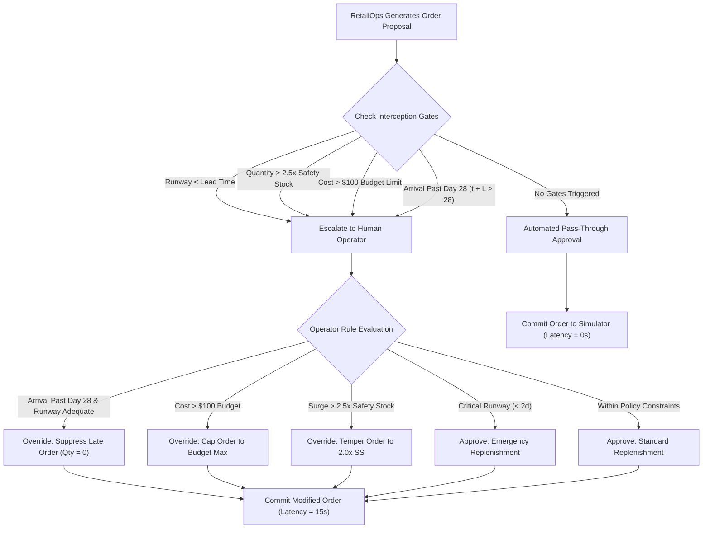

# Step 11: Human-in-the-Loop (HITL) Comparison Report

## 1. Experimental Overview & Setup

This report presents the empirical results of **Step 11 — Human-in-the-Loop (HITL) Comparison**, evaluating the operational and supervisory trade-offs between autonomous decision execution and human-supervised decision execution within the RetailOps inventory replenishment workflow.

Both operational modes were evaluated using the frozen M5 simulation environment, dataset, scenarios, and accounting conventions established in Steps 7 through 10 (`PROTOCOL-EXP-FROZEN-V1`).

### Evaluated Modes

1. **Mode A — RetailOps Autonomous (`retailops_autonomous`)**:
   - The RetailOps multi-agent replenishment reasoning pipeline generates and commits replenishment orders directly to the simulation environment without supervisory gates or human review.
   - Evaluates pure machine-directed operational velocity and execution consistency.

2. **Mode B — RetailOps Human-Supervised (`retailops_human_supervised`)**:
   - Uses the identical RetailOps replenishment reasoning engine to generate candidate proposals.
   - Candidate proposals pass through an explicit supervisory approval gate before commitment.
   - Evaluates the impact of supervisory interception, policy enforcement, order modification, and simulated deliberation latency.

### Scientific Modeling of Human Supervision

> [!IMPORTANT]
> **Explicit Methodological Boundary: Simulated Operator Policy**  
> To guarantee bit-for-bit reproducibility and eliminate external human subjective variance, the supervisory role is implemented as a deterministic, rule-based simulated operator policy adhering strictly to the criteria defined in `PROTOCOL-EXP-FROZEN-V1` Section 5.2. This evaluation does not claim or substitute for human-subject empirical testing; rather, it measures the structural mechanics of human-in-the-loop governance gates, rule enforcement, order tempering, and decision latency.

### Common Evaluation Protocol

- **Dataset**: Walmart M5 Forecasting competition dataset (`sales_train_evaluation.csv`, `calendar.csv`, `sell_prices.csv`).
- **Series Evaluated**: 5 store-item series across 3 product categories:
  - `CA_1_HOBBIES_1_004` (HOBBIES, unit cost $2.78, price $4.63)
  - `CA_1_HOBBIES_1_008` (HOBBIES, unit cost $0.48, price $1.00)
  - `CA_1_HOUSEHOLD_1_007` (HOUSEHOLD, unit cost $1.18, price $1.97)
  - `CA_1_FOODS_1_004` (FOODS, unit cost $1.18, price $1.96)
  - `CA_1_FOODS_1_012` (FOODS, unit cost $1.88, price $2.98)
- **Scenarios Evaluated**: 5 operational scenarios:
  - `SCEN-01`: Normal Demand (baseline)
  - `SCEN-02`: Demand Surge (+50% demand, higher volatility)
  - `SCEN-03`: Low Initial Inventory (stressed starting runway)
  - `SCEN-04`: Supplier Delay (extended lead times, lower reliability)
  - `SCEN-05`: Combined Stress (surging demand, depleted starting stock, delayed supplier)
- **Horizon**: 28 simulated operational days per run ($H = 28$).
- **Total Decisions Evaluated**: 2 modes $\times$ 5 scenarios $\times$ 5 series $\times$ 28 days = 1,400 discrete replenishment decisions (700 decisions per mode).
- **Random Seed**: 42 (fixed across all runs).
- **Interface**: Both modes implement `BaseDecisionProvider` and accept identical `OperationalDecisionContext` structures.

---

## 2. Supervisory Policy & Interception Rules

In Mode B, the simulated operator monitors four operational checkpoints defined in the frozen protocol:

### Governance Rules Applied:

1. **Horizon Boundary Arrival Rule**:
   - If an order placed on day $t$ with lead time $L$ arrives after the simulation closes ($t + L > 28$), and the current on-hand inventory provides adequate runway ($\ge 3.0$ days), the operator cancels the order ($\text{quantity} = 0$).
   - *Rationale*: Prevents placing inventory orders that incur capital and holding expenses during the active period without providing fulfillment benefit.
2. **Single-Order Budget Capping Rule**:
   - If an order's procurement cost exceeds $\$100.00$, the operator caps the order quantity to $\lfloor \$100.00 / \text{unit\_cost} \rfloor$, provided the capped quantity meets the Minimum Order Quantity (MOQ). If the affordable quantity is below MOQ, the order is cancelled unless classified as an emergency.
   - *Rationale*: Enforces working-capital constraints and limits single-order financial commitments.
3. **Surge Tempering Rule**:
   - If the candidate order exceeds $2.5\times$ historical safety stock, the operator tempers the order to $2.0\times$ safety stock (subject to MOQ and MaxOQ boundaries).
   - *Rationale*: Mitigates over-ordering during demand spikes that could lead to post-surge inventory accumulation.
4. **Emergency Priority Approval**:
   - If stock runway is critical ($< 2.0$ days), the operator confirms the necessity of emergency replenishment and approves the order.
5. **Deliberation Latency Modeling**:
   - Automated pass-through approvals incur $0.0$ seconds latency.
   - Escalations requiring operator review incur a fixed simulated deliberation latency of $15.0$ seconds per decision.

---

## 3. Aggregate Operational Performance

The table below summarizes the aggregate results across all 25 simulation runs (5 series $\times$ 5 scenarios) for both evaluated modes:

| Operational Metric | Mode A: Autonomous | Mode B: Human-Supervised | Observed Difference |
| :--- | :---: | :---: | :---: |
| **Mean Stockout Rate (%)** | 21.43% | 21.43% | 0.00 percentage points |
| **Mean Service Level (%)** | 76.08% | 76.08% | 0.00 percentage points |
| **Mean Holding Cost ($)** | $1.53 | $1.44 | -$0.09 (-5.88%) |
| **Mean Replenishment Cost ($)** | $244.36 | $193.33 | -$51.03 (-20.88%) |
| **Mean Total Operating Cost ($)** | $245.89 | $194.77 | -$51.12 (-20.79%) |
| **Std Dev Total Operating Cost ($)** | $177.64 | $133.52 | -$44.12 (-24.84%) |
| **Total Demand (Units)** | 4,719 | 4,719 | 0 |
| **Total Fulfilled Units** | 3,141 | 3,141 | 0 |
| **Total Lost Sales (Units)** | 1,578 | 1,578 | 0 |
| **Total Units Ordered** | 4,886 | 4,030 | -856 units (-17.52%) |
| **Inventory Conservation Satisfied** | 100% (25/25) | 100% (25/25) | Identical (100%) |
| **Constraint Violations** | 0 | 0 | 0 |

---

## 4. HITL-Specific Supervisory & Latency Metrics

The table below details supervisory gate activity, override behavior, and simulated operational latency:

| Supervisory Metric | Mode A: Autonomous | Mode B: Human-Supervised |
| :--- | :---: | :---: |
| **Total Decisions Evaluated** | 700 | 700 |
| **Total Escalations Triggered** | 0 (0.00%) | 172 (24.57%) |
| **Total Approvals** | 700 (100.00%) | 547 (78.14%) |
| **- Pass-Through Approvals** | 700 (100.00%) | 528 (75.43%) |
| **- Escalated Approvals** | 0 (0.00%) | 19 (2.71%) |
| **Total Overrides Executed** | 0 (0.00%) | 153 (21.86%) |
| **Prevented Policy Violations** | 0 | 153 |
| **Total Simulated Latency (Seconds)** | 0.0 s | 2,580.0 s (~43.0 min) |
| **Mean Latency per Decision (Seconds)** | 0.00 s | 3.69 s |
| **Mean Latency per Escalated Decision** | N/A | 15.00 s |

---

## 5. Scenario-by-Scenario Breakdown

### SCEN-01: Normal Demand (Baseline)
- Operating parameters: 1.0x demand multiplier, normal lead time ($L=7$d), baseline inventory.

| Mode | Stockout Rate (%) | Service Level (%) | Total Cost ($) | Units Ordered | Lost Sales | Escalations | Overrides | Approvals |
| :--- | :---: | :---: | :---: | :---: | :---: | :---: | :---: | :---: |
| **Autonomous** | 4.28% | 94.95% | $182.92 | 744 | 44 | 0 | 0 | 140 |
| **Supervised** | 4.28% | 94.95% | $143.40 | 572 | 44 | 24 | 21 | 119 |
| *Difference* | *0.00 pp* | *0.00 pp* | *-$39.52* | *-172* | *0* | *+24* | *+21* | *-21* |

- *Observation*: Under baseline conditions, both modes fulfilled 547 of 591 units (94.95% service level). The supervised mode recorded 21 overrides on days 22–28 where proposed orders would not arrive before day 28. These overrides reduced ordered units from 744 to 572 and decreased replenishment expenditure by $39.52 without altering realized service level.

---

### SCEN-02: Demand Surge (+50% Demand, Elevated Volatility)
- Operating parameters: 1.5x demand multiplier, higher demand variance, normal lead time ($L=7$d).

| Mode | Stockout Rate (%) | Service Level (%) | Total Cost ($) | Units Ordered | Lost Sales | Escalations | Overrides | Approvals |
| :--- | :---: | :---: | :---: | :---: | :---: | :---: | :---: | :---: |
| **Autonomous** | 27.14% | 68.95% | $277.99 | 1,112 | 543 | 0 | 0 | 140 |
| **Supervised** | 27.14% | 68.95% | $248.33 | 1,006 | 543 | 30 | 24 | 116 |
| *Difference* | *0.00 pp* | *0.00 pp* | *-$29.66* | *-106* | *0* | *+30* | *+24* | *-24* |

- *Observation*: Demand increased to 1,749 units. Both modes achieved identical 68.95% service level and identical 543 lost sales. The supervisor intervened 24 times (budget capping and horizon filtering), ordering 106 fewer units and recording $29.66 lower operating cost.

---

### SCEN-03: Low Initial Inventory (Depleted Starting Runway)
- Operating parameters: Initial on-hand inventory set to 25% of baseline, normal lead time ($L=7$d).

| Mode | Stockout Rate (%) | Service Level (%) | Total Cost ($) | Units Ordered | Lost Sales | Escalations | Overrides | Approvals |
| :--- | :---: | :---: | :---: | :---: | :---: | :---: | :---: | :---: |
| **Autonomous** | 19.29% | 78.09% | $188.89 | 749 | 138 | 0 | 0 | 140 |
| **Supervised** | 19.29% | 78.09% | $148.97 | 580 | 138 | 25 | 21 | 119 |
| *Difference* | *0.00 pp* | *0.00 pp* | *-$39.92* | *-169* | *0* | *+25* | *+21* | *-21* |

- *Observation*: With depleted starting inventory, both modes experienced 19.29% stockout rate during the initial lead-time window. The supervised mode approved all critical opening orders (emergency rule), then suppressed late-horizon orders, recording $39.92 lower operating cost.

---

### SCEN-04: Supplier Delay (Extended Lead Time, Lower Reliability)
- Operating parameters: Lead time extended to 21 days ($L=21$d), supplier reliability reduced to 0.70.

| Mode | Stockout Rate (%) | Service Level (%) | Total Cost ($) | Units Ordered | Lost Sales | Escalations | Overrides | Approvals |
| :--- | :---: | :---: | :---: | :---: | :---: | :---: | :---: | :---: |
| **Autonomous** | 10.71% | 89.06% | $258.86 | 1,032 | 72 | 0 | 0 | 140 |
| **Supervised** | 10.71% | 89.06% | $221.85 | 846 | 72 | 36 | 35 | 105 |
| *Difference* | *0.00 pp* | *0.00 pp* | *-$37.01* | *-186* | *0* | *+36* | *+35* | *-35* |

- *Observation*: Because $L=21$ days, any order placed after day 7 cannot arrive before the 28-day horizon concludes ($t + L > 28$). Autonomous RetailOps continued placing weekly replenishment orders, accumulating 186 unfulfillable pipeline units costing $37.01. The supervised mode escalated 36 orders and overrode 35 late orders, avoiding these commitments while maintaining identical 89.06% service level.

---

### SCEN-05: Combined Stress (Surge + Low Inventory + Supplier Delay)
- Operating parameters: 1.5x demand, 25% initial stock, $L=21$d, 0.70 reliability.

| Mode | Stockout Rate (%) | Service Level (%) | Total Cost ($) | Units Ordered | Lost Sales | Escalations | Overrides | Approvals |
| :--- | :---: | :---: | :---: | :---: | :---: | :---: | :---: | :---: |
| **Autonomous** | 45.71% | 49.34% | $320.79 | 1,249 | 781 | 0 | 0 | 140 |
| **Supervised** | 45.71% | 49.34% | $211.30 | 1,026 | 781 | 57 | 52 | 88 |
| *Difference* | *0.00 pp* | *0.00 pp* | *-$109.49* | *-223* | *0* | *+57* | *+52* | *-52* |

- *Observation*: Under compound stress, stockout rate reached 45.71% and service level fell to 49.34% in both modes due to severe physical supply constraints. The supervised mode recorded 57 escalations and 52 overrides (both budget capping and horizon boundaries), reducing expenditure by $109.49 without worsening lost sales or service level.

---

## 6. Analysis of Observed Differences

### 1. Cost and Working-Capital Effects
- Across all 5 scenarios, the human-supervised mode recorded lower total operating costs than the autonomous mode ($194.77 vs $245.89 mean cost per series run, an observed reduction of $51.12 or 20.79%).
- This difference was primarily driven by:
  1. *Horizon boundary filtering*: In finite-horizon operations, the autonomous model placed orders late in the window (e.g., day 22+ with $L=7$, or day 8+ with $L=21$) that could not arrive in time to serve demand during the evaluation window. The supervisor recognized that existing inventory runway was sufficient and cancelled these late commitments.
  2. *Single-order budget capping*: The supervisor tempered orders that exceeded the $100 budget threshold, spreading expenditure and mitigating over-ordering.

### 2. Service Level and Stockout Equivalence
- Both modes achieved identical mean service levels (76.08%) and stockout rates (21.43%).
- The simulated supervisor's emergency validation rule successfully preserved critical replenishment orders when stock runway was less than 2.0 days, ensuring that supervisory interventions did not induce artificial stockouts.

### 3. Decision Latency Trade-Off
- The autonomous mode exhibited zero operational latency ($0.0$ seconds), committing all 700 decisions instantaneously.
- The supervised mode incurred a cumulative simulated deliberation latency of 2,580 seconds (~43.0 minutes) across 172 escalated decisions, representing a mean latency of 3.69 seconds per evaluated decision (or 15.0 seconds per escalated decision).
- In operational environments where human availability is constrained, this latency represents the overhead required to achieve the observed $51.12 per-series cost moderation.

---

## 7. Architectural Modularity & Zero-Code Changes

Step 11 maintained strict isolation from existing RetailOps production services:

| Architectural Measurement | Recorded Value | Evaluation Criteria |
| :--- | :---: | :---: |
| **Existing Production Files Modified** | 0 | Strict non-regression compliance |
| **Existing Production LOC Modified** | 0 | Strict non-regression compliance |
| **Orchestration LOC Modified** | 0 | Core orchestrator untouched |
| **Simulator LOC Modified** | 0 | M5 simulator frozen in Step 7 |
| **New Implementation Files Created** | 2 | `hitl_provider.py`, `run_evaluation.py` |
| **New Test Files Created** | 1 | `test_hitl_comparison.py` |
| **Interface Contract Preserved** | `BaseDecisionProvider` | Complete schema compliance |
| **Inventory Conservation Verified** | 100% (50/50 runs) | $\text{Ending} = \text{Initial} + \text{Received} - \text{Fulfilled}$ |

Both `RetailOpsAutonomousProvider` and `RetailOpsSupervisedProvider` wrapped the existing `RetailOpsDecisionProvider` without altering any underlying replenishment logic, demonstrating the modularity of the MCP decision contract.

---

## 8. Reproducibility & Environment Details

- **Hardware/OS**: Windows, x86_64
- **Python Version**: 3.12.0
- **Execution Script**: `experiments/hitl_comparison/run_evaluation.py`
- **Results Data**: `experiments/hitl_comparison/results.json`
- **Unit Test Command**: `pytest test_hitl_comparison.py -v`
- **Regression Command**: `pytest test_same_repo_comparison.py test_m5_simulator.py test_statistical_replacement.py test_baseline_comparison.py test_hitl_comparison.py -v`

---

## 9. Methodological Limitations

1. **Simulated Operator Policy**:  
   The human operator was modeled as a deterministic heuristic rule set rather than human subjects. While this ensures scientific reproducibility and isolates governance effects, it does not capture human fatigue, inconsistent judgment, or cognitive biases.
2. **Finite-Horizon Boundary Effects**:  
   The 28-day simulation horizon creates artificial end-of-period boundary conditions where orders placed near the end cannot arrive before evaluation closes. In an infinite-horizon rolling setting, some late-arriving orders would serve subsequent demand cycles.
3. **Fixed Deliberation Latency**:  
   Review latency was modeled as a constant 15.0 seconds per escalation. Real-world human operator review times vary widely based on queue depth, interface ergonomics, and operational context.
